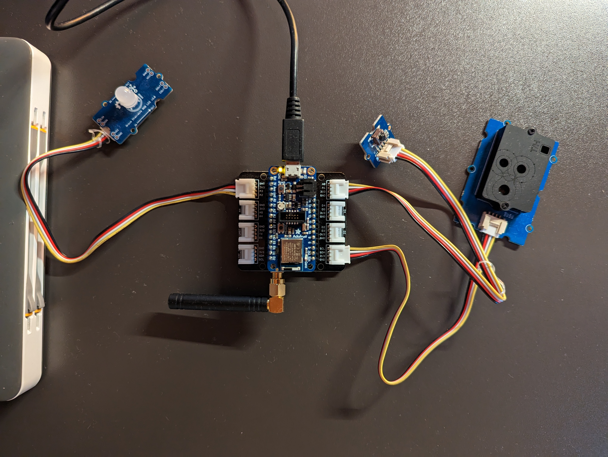
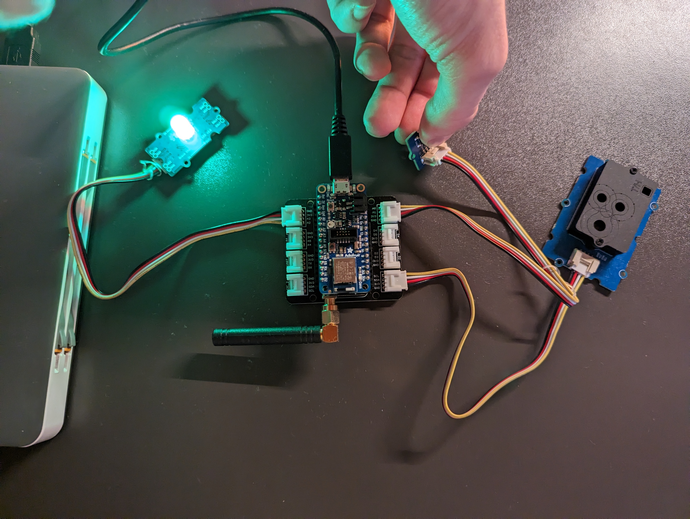
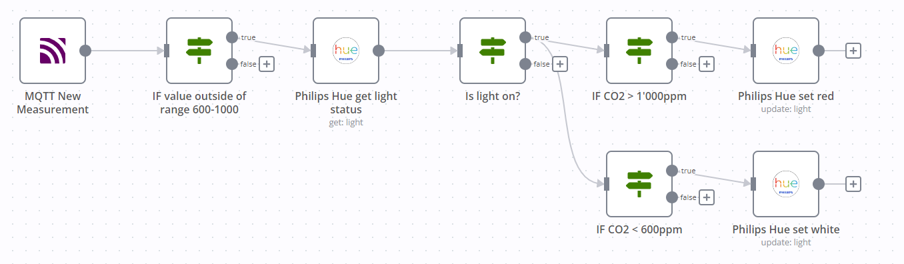
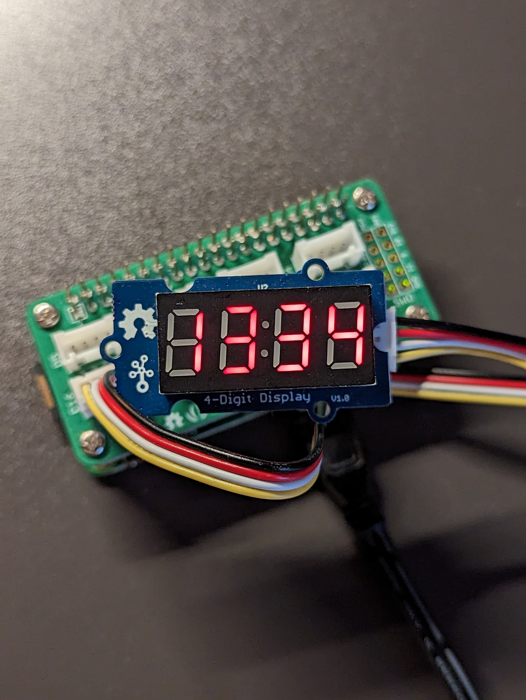

# idb
This repository contains an example IoT application. It consists of a feather device with LoRa connectivity measuring co2, temperature and humidity and sending it over the TTN's LoRa Network.
From there, the measurments are distributed over MQTT. There are two devices listening on the MQTT topic. One is a simple python script that displays the co2 value on a 4-digit 7-segment display. The other is n8n (a workflow automation tool) that turns a philips hue light red if the co2 exceeds 1000ppms.

# Files
## co2_lora.py

The file that runs on the feather device. Measures and sends the data (co2, temperature, humidity) over LoRa. Also turns on a LED if a button is pressed. The button is red if the co2 exceeds 1000ppms and green otherwise.

## payload_formatter.py
The custom payload formatter for the TTN application. It converts the payload ("CO2;TEMP;HUMIDITY") from the feather device to json format ({co2: CO2, temperature: TEMP, humidity: HUMIDITY}).

## LoRa_over_MQTT_n8n-workflow.json

The n8n workflow that listens on the MQTT topic and turns the philips hue light red if the co2 exceeds 1000ppms. 

## mqtt4digit.py

The python script that listens on the MQTT topic and displays the co2 value on a 4-digit 7-segment display.

## red_green_light.py
Simple unrelated test script I created, that turns the LED green if it's dark and red if it's bright.